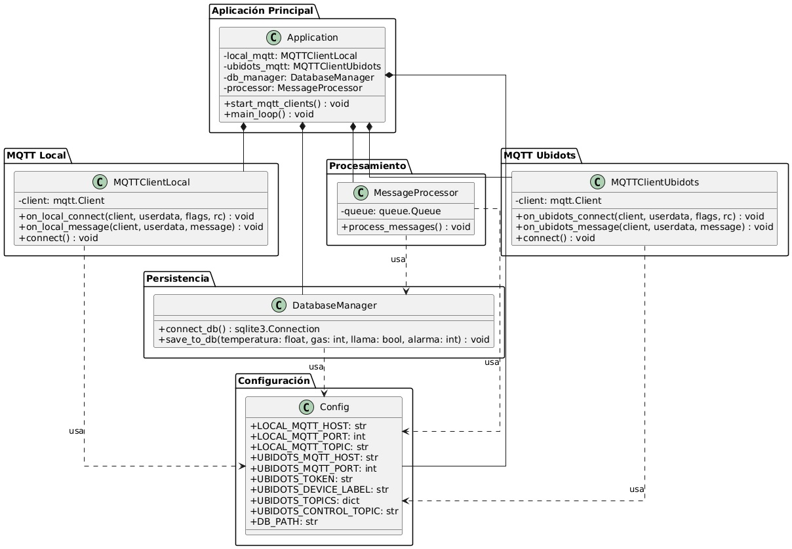

# Sistema IoT para Detección Temprana de Incendios - Reto 3

## Miembros: Samuel Rodriguez, Valentina Ruiz Torres y Darek Aljuri Martínez

## 1. Introducción
### 1.1 Resumen General
te documento describe el desarrollo de un sistema IoT de monitoreo ambiental para la detección temprana de incendios forestales en los cerros orientales de Bogotá. En esta tercera fase, se integra un enfoque más robusto de conectividad y escalabilidad mediante el uso conjunto del microcontrolador ESP32 y una Raspberry Pi como gateway IoT, con almacenamiento local y transmisión a una plataforma en la nube. Además, se ha incorporado un mecanismo de notificaciones por SMS a teléfonos móviles: cuando cualquiera de las variables críticas (temperatura, nivel de gas o detección de llama) supera sus umbrales definidos, el sistema envía de inmediato un mensaje de texto con el nombre de la variable, su valor exacto y la marca de tiempo, garantizando que la alerta llegue tanto in situ como de forma remota a los responsables.
### 1.2 Motivación
Los cerros orientales de Bogotá son una zona ecológica de gran importancia, pero altamente susceptible a incendios forestales debido a la sequía y actividad humana. 
La detección temprana de incendios es clave para minimizar daños ambientales y proteger comunidades cercanas. Para ello, se requiere un sistema de monitoreo en tiempo real que permita detectar cambios bruscos en temperatura, presencia de humo y emisión de gases característicos de la combustión. Además, es fundamental contar con una plataforma que no solo permita visualizar el historial de datos y activar alarmas físicas de manera remota, sino que también genere alertas automáticas y en forma de sms en caso de riesgo inminente de incendio, facilitando una respuesta rápida y efectiva.

### 1.3 Justificación
El desarrollo de este sistema surge de la necesidad de implementar una solución de bajo costo y fácil instalación para la detección temprana de incendios forestales en zonas vulnerables, como los cerros orientales de Bogotá. A través del uso de sensores especializados, el sistema permite identificar la presencia de gases, humo y variaciones anómalas de temperatura, proporcionando información clave para una respuesta oportuna.

En este nuevo contexto, la solución se expande más allá del monitoreo local, integrando capacidades que permiten la supervisión remota desde cualquier lugar del país. Esta ampliación responde a la necesidad de contar con un tablero de control accesible tanto local como globalmente, desde el cual las autoridades puedan observar en tiempo real las condiciones del entorno, recibir notificaciones ante posibles emergencias y tomar decisiones informadas de forma inmediata.

De esta manera, se busca no solo ofrecer una herramienta de alerta temprana en el sitio de riesgo, sino también habilitar canales eficientes de comunicación y control centralizado, facilitando una gestión más efectiva ante posibles amenazas ambientales.

### 1.4 Estructura de la Documentación

Este documento se divide en las siguientes secciones:

1. **Solución propuesta**: Restricciones, arquitectura, desarrollo teórico y estándares aplicados.
2. **Configuración experimental y resultados**: Validación del sistema en condiciones controladas.
3. **Autoevaluación del protocolo de pruebas**: Verificación de confiabilidad y precisión.
4. **Conclusiones y trabajo futuro**: Desafíos enfrentados y mejoras futuras.
5. **Anexos**: Código fuente, esquemáticos y documentación adicional.
## 2. Solución Propuesta
### 2.1 Restricciones de Diseño

***Técnicas***
- Uso de un ESP32 como microcontrolador central. Este dispositivo, además de ser de código abierto, incorpora un microcontrolador reprogramable con conectividad Wi-Fi y Bluetooth, así como múltiples pines de entrada y salida analógicos y digitales. Esto permite la conexión eficiente con sensores y actuadores. "El ESP32 destaca por su alto rendimiento gracias a su procesador de doble núcleo. Puede llegar hasta 240 MHz, manejando tareas complejas y procesamiento en tiempo real. Esto es clave para proyectos IoT avanzados que necesitan manejar varios procesos a la vez" [1]
- Sensor de temperatura DS18B20, "permite medir la temperatura a través de un termistor NTC, un comparador LM393, y un potenciometro"[2], esto le permite al sensor adecuar una señal de trabajo operable digital.
- Sensor de gas (MQ-2), "Este sensor es adecuado para detectar GLP, I-butano, propano, metano, alcohol, hidrógeno y humo. Tiene alta sensibilidad y respuesta rápida"[3], ademas de esto cuenta con un potenciometrp para ajustar la sensibilidad.
- Sensor de Llama (KY-026). "Consta de un LED receptor de infrarrojos de 5 mm, un comparador diferencial dual LM393, un potenciómetro de recorte de 3296 W, 6 resistencias, y 4 pines de cabezal macho"[4] Es decir que detecta la luz infrarroja emitida por el fuego, y debido a su potenciometro se puede ajustar su sensibilidad.
- Pantalla LCD, con un modulo I2C para visualización de datos en tiempo real. Modulo utilizado debido a que facilita la conexión de cables y uso de pines del arduino, haciendo uso de solo dos (SDA y SCL), asi mismo se trabajo con la libreria LiquidCrystal_I2C.h, facilitando el codigo para hacer uso del LCD.
- Buzzer para alertas sonoras en caso de detección de incendio.
- Uso de una Raspberry Pi como Gateway IoT, con capacidad de recibir datos desde el ESP32 a través de MQTT, procesarlos y almacenarlos en una base de datos local (SQLite), y retransmitirlos a una plataforma IoT en la nube.
- Comunicación mediante el protocolo MQTT para la transmisión eficiente y ligera de datos entre dispositivos IoT y plataformas en la nube.
- Acceso remoto al sistema desde cualquier lugar mediante una plataforma IoT basada en la nube, que presenta los datos en un tablero de control global accesible por navegador web.

 
***Económicas***
- Implementación con componentes de bajo costo y accesibles.
- Uso de software de código abierto compatible con el ESP32 y Raspberry Pi para minimizar costos de desarrollo, implementado con el IDE Arduino y herramientas compatibles con Python en la Raspberry Pi.
- Uso de una plataforma basada en la nube
  
***Espacio y Escalabilidad***
- Diseño compacto para facilitar su instalación en zonas estratégicas.
- Posibilidad de expansión mediante comunicación con otros dispositivos IoT gracias a la conectividad Wi-Fi del ESP32 y la Raspberry Pi.
- Adaptabilidad para futuras mejoras con nuevos sensores o algoritmos de detección.

  
***Temporales***
- Desarrollo del prototipo en un plazo limitado, asegurando funcionalidad básica para detección, monitoreo y notificación.
- Implementación por etapas: primero el monitoreo local, luego la transmisión a la nube y, finalmente, la visualización remota.
- Posibilidad de mejoras futuras en algoritmos de detección, análisis de datos, y visualización en la plataforma IoT.

## 2.2 Arquitectura Propuesta

***Arquitectura IoT del Sistema***

La arquitectura IoT permite la transmisión de información digitalizada a través de la red, llevando los datos capturados por los sensores hacia un centro de procesamiento local, donde son analizados y almacenados. Posteriormente, mediante actuadores, se pueden emitir comandos para que los dispositivos conectados ejecuten acciones específicas, como la activación o desactivación de un mecanismo.

El sistema de detección de incendios está basado en una estructura distribuida compuesta por sensores, procesamiento local y comunicación de datos para la notificación de alertas. Se organiza en tres capas principales:

1. Capa de Percepción (Sensores y Adquisición de Datos)
Es la capa encargada de capturar la información del entorno mediante sensores físicos. Los dispositivos utilizados incluyen:

- Sensor de temperatura (): Mide la temperatura del aire en la zona monitoreada.
- Sensor de gas (): Detecta concentraciones de gases como CO y CO₂, indicativos de combustión.
- Sensor de llama (): Detecta la presencia de llamas en el área monitoreada.
Los sensores están conectados a un ESP32, que procesa la información en tiempo real.

2. Capa de Procesamiento y Control
El ESP32 actúa como la unidad central de procesamiento (CPU) del nodo sensor, encargada de:
- Leer y analizar los datos recibidos de los sensores.
- Determinar si las condiciones indican un posible incendio.
- Activar mecanismos de alerta local (buzzer, LED RGB y pantalla LCD).
- Mostrar en tiempo real los datos en la pantalla LCD mediante I2C.
- Ejecutar un servidor web local para acceder a los valores de sensores desde la red.
- Transmitir los datos vía MQTT a una unidad de procesamiento superior (Raspberry Pi).

Una Raspberry Pi cumple el rol de Gateway IoT, recibiendo los datos de múltiples nodos (ESP32) mediante MQTT, lo que permite concentrar la información para su posterior análisis y envío.

***La Raspberry Pi:***

- Se conecta al broker MQTT para recibir los mensajes enviados por los sensores.
- Almacena la información en una base de datos local (SQLite) para análisis histórico.
- Gestiona el envío de los datos hacia la nube mediante conexión segura.

3. Capa de Comunicación y Notificación
Esta capa es responsable de garantizar que los datos lleguen al usuario de forma clara y en tiempo real. En esta etapa se incluye tanto la notificación local como el monitoreo remoto:

***Notificación Local:***

- Pantalla LCD (I2C 16x2): Muestra los valores de temperatura, gas y llama en tiempo real, así como advertencias de peligro.
- LED RGB: Indica el estado del sistema (normal, precaución, alerta).
- Buzzer: Emite sonidos de alarma ante situaciones críticas detectadas por los sensores.
- Servidor Web embebido: El ESP32 incluye una página web local donde se visualizan los datos actuales del sistema.

***Comunicación hacia el Exterior:***

- Protocolo MQTT: Facilita la comunicación entre el ESP32 (nodo sensor) y la Raspberry Pi (gateway), usando un enfoque ligero y eficiente para IoT. MQTT es un protocolo de mensajería basado en estándares, o un conjunto de reglas, que se utiliza para la comunicación de un equipo a otro, admite la mensajería entre dispositivos a la nube y la nube al dispositivo. [10]
- Gateway Raspberry Pi: Centraliza la información de varios nodos, almacena los datos en una base de datos local y los reenvía a una plataforma de monitoreo en la nube.
- Plataforma Ubidots: Presenta un tablero de control global, es utilizada para visualizar las variables en tiempo real, también nos permite modificar las variables del proceso desde cualquier parte del mundo, los cambios se pueden realizar mediante internet atreves de la página web Ubidots.[9]
- Acceso remoto y multiplataforma: El sistema es accesible desde computadoras o dispositivos móviles, permitiendo la supervisión continua sin importar la ubicación física del usuario.

## 2.3 Desarrollo Teórico Modular

#### **Principios de Diseño del Sistema**
- **Fiabilidad:** Uso de sensores calibrados para evitar falsas alarmas.
- **Bajo Consumo Energético:** Optimización del código para minimizar el consumo de energía.
- **Interfaz Intuitiva:** Uso de una pantalla LCD y alertas sonoras para notificaciones claras.
- **Escalabilidad:**
   - ***Escalabilidad Local:*** El sistema permite agregar sensores adicionales (por ejemplo, sensores de humedad del suelo o viento) y módulos de expansión conectados vía I2C o SPI.
   - ***Escalabilidad Remota:*** El diseño contempla la inclusión de una plataforma IoT basada en la nube (recomendada: Ubidots) que recibe los datos desde una Raspberry Pi actuando como Gateway IoT, permitiendo acceso al tablero de control desde cualquier parte del país vía MQTT.
   - Interconexión Modular: Cada módulo (ESP32, Raspberry Pi, plataforma IoT) se comunica mediante protocolos estándar (MQTT, HTTP), facilitando la integración de nuevas tecnologías o nodos.

- **Conectividad Dual (Local y Global):**
   - ***Local:*** El ESP32 actúa como servidor web embebido para ofrecer un tablero de control accesible desde dispositivos móviles o PCs conectados a la WLAN de la alcaldía. Desde esta interfaz se pueden visualizar datos actuales, históricos, notificaciones y controlar alarmas.
   - ***Global:*** Todos los datos recolectados por el ESP32 son enviados a través del protocolo MQTT a una Raspberry Pi que actúa como Gateway IoT. Este dispositivo almacena los datos en una base de datos SQLite local, los procesa y posteriormente los retransmite a la plataforma IoT Ubidots, accesible desde cualquier lugar del país.

- **Modularidad y Responsabilidad por Hilos:**

  - Las mediciones se ejecutan en hilos separados del hilo principal *mediante interrupciones* para asegurar respuesta inmediata del sistema sin bloquear otras funcionalidades.
  - La transmisión de datos tanto desde el ESP32 como desde la Raspberry Pi también se realiza en procesos independientes o asincrónicos para evitar congestión o pérdida de paquetes de datos.

### **Definición de umbrales de seguridad**

Para garantizar una detección confiable de incendios, se establecieron los siguientes umbrales en el sistema:

- **Temperatura máxima aceptable:** `TEMP_MAX = 30°C`
- **Nivel máximo de gas permitido:** `GAS_MAX = 700`
- **Cambio brusco de temperatura:** Se define como un incremento mayor a `5°C` en comparación con la lectura anterior.

Estos valores permiten detectar condiciones anómalas en el ambiente y activar una alerta en caso de peligro.

### **Justificación del umbral de temperatura**

Según el planteamiento inicial del reto, la zona de interés presenta temperaturas medias anuales entre **8.4°C y 13°C**.  
Sin embargo, se decidió establecer un umbral superior de **30°C** para la activación de alertas por las siguientes razones:

1. **Prevención de falsas alarmas:**  
   - En condiciones normales, un umbral demasiado bajo podría generar **alertas innecesarias**, activándose por aumentos naturales de temperatura.
   - Se buscó un equilibrio entre sensibilidad y precisión en la detección de incendios.

2. **Consideración de escenarios extremos:**  
   - En ciertas circunstancias (como exposición solar directa, equipos en funcionamiento o ventilación deficiente), la temperatura en el entorno puede superar los valores promedio de la región.
   - Un umbral más alto permite descartar estas fluctuaciones y centrarse en **situaciones realmente peligrosas**.

3. **Adaptación a condiciones reales de incendio:**  
  - Según el documento "Las fases de un incendio", durante la fase de incremento de un incendio, la temperatura aumenta rápidamente, situándose entre los 300°C y los 700°C. [5] Este incremento significativo de temperatura en las etapas iniciales de un incendio respalda la decisión de establecer un umbral de 30°C en nuestro sistema de detección. Aunque las temperaturas medias anuales en la zona de interés varían entre 8.4°C y 13°C, un aumento repentino que supere los 30°C podría indicar una situación anómala que requiera atención inmediata. Por lo tanto, este umbral permite detectar de manera efectiva un incipiente foco de incendio sin comprometer la confiabilidad del sistema.​   

4. **Resultados observados en la fase de pruebas de laboratorio:**  
   - Durante las pruebas en el laboratorio, se registraron temperaturas promedio entre **25°C y 27°C**.  
   - Esto evidenció que, aunque las temperaturas externas sean más bajas, el ambiente de prueba puede ser significativamente más cálido.  
   - Debido a esto, **se estableció 30°C como un valor adecuado para definir una temperatura "alta"**, asegurando que las alertas solo se activen en condiciones realmente anómalas.

### **Condiciones de activación de alerta**
El sistema genera una alerta cuando ocurre cualquiera de las siguientes condiciones:

1. **Sobrecalentamiento y gas elevado:** La temperatura supera los `30°C` y el nivel de gas es mayor a `700`.
2. **Presencia de llama:** Se detecta una llama a través del sensor (`PIN_LLAMAS`).
3. **Cambio brusco de temperatura:** Se registra un incremento superior a `5°C` en comparación con la última medición.

Cuando se activa una de estas condiciones, el sistema toma medidas inmediatas para alertar al usuario.

### **Consideraciones del entorno de laboratorio**
Las condiciones ambientales en el laboratorio difieren del entorno final donde se implementará el sistema. Por este motivo:

- Se ajustaron los umbrales para adaptarse al entorno de prueba y minimizar **falsos positivos**.
- Se añadió un umbral para detectar cambios bruscos de temperatura (`>5°C`), mejorando la precisión en la identificación de incendios.

Estos ajustes garantizan que el sistema responda correctamente sin generar alertas innecesarias.

### **Funcionamiento de la detección de cambios bruscos de temperatura**
El sistema monitorea la temperatura de forma continua para identificar cambios abruptos:

1. **Comparación de lecturas:** Se compara la temperatura actual (`valorTemp`) con la última registrada (`tempAnt`).
2. **Detección de incremento abrupto:** Si la diferencia supera `5°C`, se activa el indicador `saltoTemp = true`.
3. **Registro y notificación:**
   - El evento se almacena en el sistema de logs.
   - La información se envía a la interfaz web para que el usuario la visualice en tiempo real.

### **Intervalo de detección de cambios de temperatura**
- La temperatura se actualiza cada `500 ms` (`refresco = 500`), permitiendo una detección casi en **tiempo real**.
- Esto garantiza que cualquier cambio repentino se registre de manera inmediata y se tomen acciones rápidas.

### **Respuesta del sistema ante detección de incendio**
Si se activa una alerta por alguna de las condiciones previamente definidas, el sistema ejecuta las siguientes acciones:

**Indicadores visuales y auditivos:**
- Se enciende el **LED RGB en rojo** para señalar peligro.
- Se activa el **zumbador (buzzer)** con una frecuencia de `1000 Hz`.
- La pantalla **LCD muestra el mensaje "FUEGO!"** para alertar al usuario.

**Monitoreo en tiempo real (local y global):**
- La alerta y los datos de los sensores se envían a la interfaz web embebida alojada en el ESP32, accesible desde dispositivos conectados a la WLAN ofrecida por la alcaldía.
- A través del “Tablero de control local”, las autoridades pueden:
   - Visualizar las variables físicas actuales.
   - Ver un histórico reciente almacenado temporalmente en el ESP32.
   - Recibir notificaciones visuales.
   - Desactivar alarmas físicas mediante botones en la interfaz.

**Envío de datos al Gateway IoT y plataforma en la nube:**
- Los datos del evento (temperatura, gas, llama, fecha, hora) son enviados mediante el protocolo MQTT desde el ESP32 a una Raspberry Pi que actúa como Gateway IoT.
- La Raspberry Pi:
  - Recibe y almacena los datos en una base de datos SQLite, conservando un registro estructurado de eventos y condiciones normales.
  - Procesa y retransmite los datos a la plataforma IoT en la nube, Ubidots utilizando nuevamente MQTT.
  - Permite monitoreo en tiempo real desde cualquier lugar de Colombia a través de un “Tablero de control global” alojado en dicha plataforma.

## **2.4 Manejo de tareas concurrentes**

"Un hilo es la unidad de ejecución más pequeña de un programa. El multihilo permite que un programa realice múltiples tareas simultáneamente al dividir su carga de trabajo en componentes más pequeños, ejecutables independientemente, llamados hilos" [6]

El sistema utiliza hilos mediante el sistema operativo en tiempo real (RTOS) FreeRTOS, que está integrado en el framework del ESP32. FreeRTOS permite la ejecución concurrente de tareas (hilos) en el microcontrolador, lo que mejora la capacidad del sistema para realizar múltiples operaciones de manera simultánea.

## Hilos (FreeRTOS Tasks)

En este proyecto se crean **dos tareas** con la API de FreeRTOS:

1. **Tarea “Sensores”**  
   - **Creación**  
                 xTaskCreate(
                   leerSensores,    // función que se ejecutará en el hilo
     
                   "Sensores",      // nombre de la tarea
     
                   4096,            // tamaño de pila (bytes)
     
                   NULL,            // parámetro de la tarea
     
                   1,               // prioridad (1 = baja)
     
                   NULL             // handle (no se usa)
     
                 );
     
   - **Función asociada**: `void leerSensores(void *arg)`  
     - Inicializa el sensor DS18B20 (`tempSensor.begin()`) y la resolución ADC (`analogReadResolution(10)`).  
     - En bucle infinito:
       1. Solicita temperatura (`tempSensor.requestTemperatures()` + `getTempCByIndex(0)`).
       2. Lee nivel de gas (`analogRead(gasPin)`).
       3. Detecta llama (`!digitalRead(PIN_LLAMAS)`).
       4. **Bajo mutex**: actualiza las variables globales `valorTemp`, `valorGas`, `hayLlama` y guarda en el buffer circular `logDatos[]`.
       5. `vTaskDelay(pdMS_TO_TICKS(200))` → pausa de 200 ms.

2. **Tarea “MQTT”**  
   - **Creación**  
   
               xTaskCreate(
                 enviarMqtt,      // función que se ejecutará en el hilo
                 "MQTT",          // nombre de la tarea
                 4096,            // tamaño de pila (bytes)
                 NULL,            // parámetro de la tarea
                 1,               // prioridad (1 = baja)
                 NULL             // handle (no se usa)
               );

   - **Función asociada**: `void enviarMqtt(void *arg)`  
     - En bucle infinito:
       1. Si no hay conexión, llama a `reconnect_mqtt()`.
       2. Llama a `client.loop()` para procesar callbacks MQTT.
       3. **Bajo mutex**: copia `valorTemp`, `valorGas`, `hayLlama`, `zumbOn` en variables locales.
       4. Crea un JSON con telemetría y estado de alarma (`snprintf`).
       5. Publica en `cerrosorientales/sensores` (`client.publish(...)`).
       6. `vTaskDelay(pdMS_TO_TICKS(500))` → pausa de 500 ms.

El bucle `loop()` de Arduino no crea un hilo adicional, sino que corre en el contexto principal de FreeRTOS junto a las demás tareas.

### Variables volatile
Sincronización: Las variables globales (valorTemp, valorGas, hayLlama, logDatos, etc.) son compartidas entre los hilos. Para evitar problemas de concurrencia, estas variables están marcadas como ***volatile***, lo que asegura que el compilador no optimice el acceso a ellas y que los cambios realizados por un hilo sean visibles para el otro. 
Las siguientes variables globales están declaradas como `volatile`:

- volatile float valorTemp;
- volatile int   valorGas;
- volatile bool  hayLlama;
- volatile bool  zumbOn;
- volatile bool  dispOn;
- volatile bool  rgbOn;

## **2.5 Uso de semaforos**
 Se usan para proteger datos compartidos cuando varias tareas (hilos) acceden a las mismas variables, asi las funciones de leer y escribir no se ejecutan al mismo tiempo

- Libreria usada: #include <freertos/semphr.h>

### Declaración y Creación del Mutex
En `setup()` creamos un mutex de tipo binario (protege secciones críticas):

       SemaphoreHandle_t xMutex;
       
       void setup() {
         // … otras inicializaciones …
       
         // Crear el mutex
         xMutex = xSemaphoreCreateMutex();
         if (xMutex == NULL) {
           Serial.println("Error: no se pudo crear xMutex");
         }
       
         // … crear tareas, iniciar MQTT, WebServer …
       }

- SemaphoreHandle_t: tipo de dato para almacenar el mutex.
- xSemaphoreCreateMutex(): reserva y devuelve un mutex listo para usarse.

### Tarea de Lectura de Sensores

     void leerSensores(void *arg) {
      for (;;) {
        float t = tempSensor.getTempCByIndex(0);
        int   g = analogRead(gasPin);
        bool  f = !digitalRead(PIN_LLAMAS);
    
        // Sección crítica: actualización de variables compartidas
        if (xSemaphoreTake(xMutex, portMAX_DELAY)) {
          valorTemp = t;
          valorGas  = g;
          hayLlama  = f;
          // … almacenamos en logDatos[] …
          xSemaphoreGive(xMutex);
        }
    
        vTaskDelay(pdMS_TO_TICKS(200));
      }
    }

Cada 200 ms el hilo de leerSensores actualiza varias variables globales (valorTemp, valorGas, hayLlama) y el buffer circular logDatos[]. Si justo en ese momento el hilo de MQTT o el callback MQTT están leyendo esas mismas variables (o escribiendo otras, como zumbOn), se pueden generar datos “mezclados” o inconsistentes (por ejemplo, una temperatura antigua con un valor de gas nuevo). El semáforo garantiza que la sección donde se escribe todo el bloque de variables sea atómica: ninguna otra tarea podrá leer o escribir hasta que termine la actualización completa.

### En la Tarea de Envío MQTT

       void enviarMqtt(void *arg) {
         for (;;) {
           if (xSemaphoreTake(xMutex, portMAX_DELAY)) {
             float t = valorTemp;
             int   g = valorGas;
             bool  f = hayLlama;
             bool  z = zumbOn;
             xSemaphoreGive(xMutex);
       
             // Construir y publicar JSON con t, g, f, z …
           }
           vTaskDelay(pdMS_TO_TICKS(500));
         }
       }

Antes de publicar el JSON , enviarMqtt copia bajo mutex las variables (valorTemp, valorGas, hayLlama, zumbOn) a variables locales. Sin semáforo, se podrian capturar una mezcla de valores (temperatura vieja, gas nuevo, estado de alarma intermedio). El semáforo asegura que la lectura de ese conjunto de valores sea coherente: la tarea de sensores no puede modificar nada hasta que se haya leído y enviado los datos como un bloque.

### 3. En el Callback MQTT

       void mqttCallback(char* topic, byte* payload, unsigned int length) {
         if (xSemaphoreTake(xMutex, portMAX_DELAY)) {
           if (String(topic) == topic_ctrl_buzzer) {
             zumbOn = (msg == "ON");
           }
           // … otros controles …
           xSemaphoreGive(xMutex);
         }
       }

Cuando llega un mensaje de control (“ON”/“OFF”) para la alarma, el callback actualiza variables como zumbOn, dispOn o rgbOn. Sin protección, se podria estar en medio de un enviarMqtt o de una lectura de sensores y cambiar sólo una parte del estado, dejando memoria compartida en un estado parcial. El semáforo convierte la sección de escritura del callback en una operación indivisible, de modo que ninguna otra tarea entra a usar esas variables hasta que termines de actualizarlas todas. 

### ¿Por Qué Usar Semáforos?

- Evitar Condiciones de Carrera: Sin protección, una tarea podría leer una variable mientras otra la está escribiendo, llevando a valores inconsistentes o a fallas en el sistema.

- Consistencia de Datos: Asegura que lecturas y escrituras de valorTemp, valorGas, hayLlama, zumbOn, etc. sean atómicas desde el punto de vista de cada tarea.

- Visibilidad Inmediata: Junto con volatile, garantiza que cada tarea vea el valor más reciente de la variable en memoria.

- Escalabilidad: Permite añadir más tareas futuras (p. ej. manejo de actuadores, otras comunicaciones) sin romper la integridad de los datos compartidos.

## **2.6 Funcionamiento de MQTT**

- Broker: servidor central que recibe mensajes de los clientes y los reenvía a quienes estén suscritos a esos tópicos.

- Cliente: cualquier dispositivo (ESP32, Raspberry, dashboard Ubidots, etc.) que se conecta al broker para publicar (publish) o recibir mensajes (subscribe).

- Tópico: cadena jerárquica (p. ej. "cerrosorientales/sensores") que clasifica el contenido de los mensajes.

- Publish/Subscribe: los publicadores no conocen quién recibe, y los suscriptores no conocen quién publica.

### Broker vs Cliente

| Rol     | Descripción                                                                                                                                      |
|---------|--------------------------------------------------------------------------------------------------------------------------------------------------|
| **Broker**  | Servidor central que recibe mensajes de los clientes publicadores y los reenvía a los clientes suscriptores. Mantiene la lista de tópicos. |
| **Cliente** | Dispositivo o aplicación que se conecta al broker para **publicar** mensajes (_publish_) o **recibir** mensajes (_subscribe_).               |

####  ¿Quién el Broker?
- **Mosquitto** corre en la Raspberry Pi  escuchando en el puerto 1883.  
- Actúa como punto único de intercambio de mensajes entre ESP32, scripts Python y otros clientes.

####  ¿Quiénes son los Clientes?
1. **ESP32**  
   - Se conecta al broker Mosquitto local para:
     - **Publicar** telemetría (`cerrosorientales/sensores`).  
     - **Suscribirse** a comandos de control (`cerrosorientales/control/...`).  
2. **Script Python en Raspberry**  
   - Cliente `local_client` que:
     - **Se suscribe** a `cerrosorientales/sensores` (recepción de telemetría).  
     - **Publica** a Ubidots y reenvía comandos de control de/para el ESP32.  
3. **Dashboard Ubidots**  
   - Cliente externo que:
     - **Se suscribe** a tópicos `/v1.6/devices/...` para mostrar telemetría.  
     - **Publica** en `/alarm_control/lv` para enviar comandos de control.  

#### ¿Qué es Mosquitto?
- Broker MQTT de código abierto 

**Instalación básica**

          sudo apt update
          sudo apt install mosquitto mosquitto-clients
          sudo systemctl enable mosquitto
          sudo systemctl start mosquitto

### MQTT en el esp32

1. Publicación de telemetría (es un sistema automatizado de comunicación (alámbrico o inalámbrico) que permite recopilar datos en lugares remotos. Se encarga de recoger información, procesarla y transmitirla hasta el lugar donde se monitorea el sistema.)[8]

Tarea FreeRTOS enviarMqtt lee cada 500 ms las variables globales (valorTemp, valorGas, hayLlama, zumbOn) bajo un mutex y hace:

     client.publish("cerrosorientales/sensores", json);

Cualquier cliente suscrito a ese tópico (la Raspberry) recibirá este JSON con temperatura, gas, llama y alarma.

2. Suscripción a control remoto

Al conectar al broker local:

      client.subscribe("cerrosorientales/control/zumbon");

Cuando llega un mensaje en este tópicos, mqttCallback() lo ejecuta y actualiza la variable zumbOn para encender/apagar el buzzer.

3. Publicación de toggles desde la web local

Cada handler de toggle:

       client.publish(topic_ctrl_buzzer, zumbOn ? "ON" : "OFF");
       
Así el ESP32 informa al broker local cuándo el usuario hace click en su página /toggleBuzzer, lo que dispara a la Raspberry.

### MQTT en la Raspberry (Python)

1.Suscripción a telemetría local
       
       local_client.subscribe("cerrosorientales/sensores")

on_local_message() encola cada JSON recibido para procesarlo (guardar en SQLite y reenviarlo).

2. Publicación a Ubidots

El hilo process_messages():

      for var, topic in UBIDOTS_TOPICS.items():
        ubidots_client.publish(topic, json.dumps({"value": valor}))

Mapea temperatura, gas, llama y alarma a sus tópicos /v1.6/devices/... en Ubidots.

3. Suscripción a comandos de Ubidots

      ubidots_client.subscribe(UBIDOTS_CONTROL_TOPIC) 

Cuando el usuario pulsa el switch en Ubidots, llega un mensaje {"value":0or1}, que on_ubidots_message() interpreta y hace:

     local_client.publish("cerrosorientales/control/zumbon", "1")

### Comunicación Bidireccional 

**ESP32 → Broker**

- El ESP32, como cliente, publica cada 500 ms un JSON en cerrosorientales/sensores.

- Mosquitto reenvía ese JSON al client Python (y a cualquier otro suscriptor).

**Broker → Python → Ubidots**

- El script Python, suscrito a cerrosorientales/sensores, consume esos mensajes, los almacena en SQLite y los publica en Ubidots.

**Ubidots → Broker**

- El dashboard Ubidots publica comandos en /alarm_control/lv.

- Mosquitto entrega ese mensaje al client Python.

**Python → Broker → ESP32**

- Python recibe el comando, lo interpreta y lo re-publica en cerrosorientales/control/zumbon (y otros tópicos de control).

- El ESP32, suscrito, recibe el mensaje y ejecuta mqttCallback(), activando o desactivando buzzer, pantalla o LED RGB.

**ESP32 → Broker → Python (Confirmación)**

-Cuando el usuario acciona la web local del ESP32, éste publica "ON"/"OFF" en cerrosorientales/control/....

- Python recibe y reenvía a Ubidots para mantener ambos dashboards sincronizados.

## **2.7 Ubidots**

Ubidots es una plataforma IoT basada en la nube que permite recolectar, almacenar, visualizar y actuar sobre datos de sensores en tiempo real.  
- **Dashboard personalizable**: gráficos, mapas, indicadores y notificaciones.  
- **API MQTT/HTTP**: para publicar y suscribirse a datos de forma ligera.  
- **Control remoto**: permite enviar comandos a dispositivos conectados.

#### Arquitectura de Integración

ESP32 ─── MQTT local ─── Raspberry Pi ─── MQTT Ubidots ─── Ubidots Cloud

1. ESP32 publica telemetría en el broker local (cerrosorientales/sensores).

2. Raspberry Pi (Gateway) recibe, guarda en SQLite y reenvía cada variable a Ubidots.

3. Ubidots Cloud almacena, grafica y notifica eventos; también emite comandos de control de vuelta.

#### Configuración MQTT para Ubidots

- Host: industrial.api.ubidots.com

- Puerto: 1883

- Token: En Ubidots, el **Token** es tu credencial de autenticación para conectar clientes MQTT/HTTP a la cuenta.  
  - **¿Para qué sirve?**
   - Permite a tu cliente MQTT (Raspberry Pi o ESP32) probar que está autorizado a publicar y suscribirse en tus recursos de Ubidots.  
   - Se usa en lugar de usuario/contraseña tradicionales:  
    
         ubidots_mqtt_client.username_pw_set(UBIDOTS_TOKEN, "")

#### Tópicos MQTT en Ubidots

Ubidots sigue una estructura de tópicos basada en **Devices** y **Variables**:

- **device_label**: nombre que se le asigno al device (p. ej. `raspi`).  
- **variable_label**: nombre de cada dato que se esta enviando (p. ej. `temperatura`, `gas`, `llama`, `alarma`).  
      
      UBIDOTS_TOPICS = {
          "temperatura": f"/v1.6/devices/{UBIDOTS_DEVICE_LABEL}/temperatura",
          "gas":         f"/v1.6/devices/{UBIDOTS_DEVICE_LABEL}/gas",
          "llama":       f"/v1.6/devices/{UBIDOTS_DEVICE_LABEL}/llama",
          "alarma":      f"/v1.6/devices/{UBIDOTS_DEVICE_LABEL}/alarma"
      }

#### Publicación de Telemetría
En el hilo de procesamiento de la Raspberry Pi (process_messages):
       
       for var, topic in UBIDOTS_TOPICS.items():
           payload_ub = json.dumps({"value": value})
           ubidots_mqtt_client.publish(topic, payload_ub)
           logging.info(f"Enviado a Ubidots: topic={topic}, payload={payload_ub}")

- Se formatea cada variable (temperatura, gas, llama, alarma) como JSON {"value": ...}.
- Ubidots recibe y actualiza sus widgets en el dashboard en tiempo real.

#### Suscripción a Comandos de Control
Para que el dashboard Ubidots pueda activar/desactivar el buzzer del ESP32:
         
         def on_ubidots_connect(client, userdata, flags, rc):
             if rc == 0:
                 client.subscribe(UBIDOTS_CONTROL_TOPIC)
         
         def on_ubidots_message(client, userdata, message):
             value = float(message.payload.decode())
             state = "ON" if value == 1 else "OFF"
             local_mqtt_client.publish("cerrosorientales/control/zumbon", state)

- On_ubidots_connect: se suscribe al tópico /alarm_control/lv.

- on_ubidots_message: convierte el valor recibido (0/1) en "OFF"/"ON" y lo re-publica al broker local.

- El ESP32, suscrito a cerrosorientales/control/zumbon, recibe ese comando y activa o desactiva el buzzer.

#### Flujo Completo de Datos en Ubidots

1. Raspberry Pi publica en MQTT Ubidots.

2. Ubidots Cloud recibe y visualiza:
   - Gráficos de línea para tendencias.
   - Indicadores de valor actual.
   - Alertas configurables (email, SMS, webhook).

3. Operador puede interactuar con el dashboard:
   - Desactivar buzzer (publica en `/alarm_control/lv`).

## Configuración de Alertas SMS en Ubidots

### Evento de Alerta por Umbral
- **Qué hace:** cuando las variables temperatura y gas estan por encima del umbral o hay llama, Ubidots dispara un evento SMS.  
- **Contenido del mensaje:**  
  - Nombre de la variable que activó la alerta.  
  - Valor exacto de esa variable al momento del umbral.  
  - Marca de tiempo (fecha y hora) de la lectura.
  - Mensaje de "revisar el valor actual  y acutuar"
 

  
  

    
### Evento “Posible Incendio”
Dado que Ubidots no permite agrupar en una sola alerta los umbrales de temperatura y gas, cuando ambas variables superan su límite el sistema emite dos SMS independientes, uno por temperatura y otro por gas, cada uno con el texto “Posible incendio”. La detección de llama, por su parte, se mantiene como un evento SMS separado (“mensaje llama”).
  

  

**Solo SMS**: no se envían notificaciones por email ni webhook, solo texto al número configurado.

## Paso a Paso para Crear el Evento SMS en Ubidots

1. En la cuenta de Ubidots ir al menú **“Events & Alerts”**.  
2. Hacer clic en **“New Event”**.  
3. Asignar un nombre descriptivo, p. ej. **“Alerta Sensor”**.  

4. **Definir condición**:  
   - Seleccionar la variable **“temperatura”**, operador **>**, umbral **30**.  
   -  añadir cláusula para **gas > 700**.  
   -  añadir cláusula para **llama == 1**.  
5. **Configurar acción**:  
   - Elegir **“Send SMS”**.  
   - Ingresar número de teléfono destino.  

6. **Personalizar mensaje**:
7. **al final se tienen 3 eventos configurados (el de posible incendio y el de llama detectada)**
     

  

## **2.8 Diagramas UML**
1. **Diagrama de Caso de Uso**: Describe la interacción entre los usuarios y el sistema

  

   
2.1 **Diagrama de Clases ESP32**: Representación de la estructura del software.

  

2.2 **Diagrama de Clases Python Raspberry**: Representación de la estructura del software.

  

3.1 **Diagrama de Secuencia ESP32**: Flujo de datos y eventos en el sistema.

  

   
3.2 **Diagrama de Secuencia Python Raspberry**: Flujo de datos y eventos en el sistema.

  

3.3 **Diagrama de Secuencia general**: 

  

   

   
4.1 **Diagrama de Estados ESP32:** Estados del sistema según las condiciones detectadas.

*Estado: Inicio*  
- Se ejecuta `setup()`: inicializa Serial, configura pines y mutex, conecta a Wi-Fi y al broker MQTT, crea tareas FreeRTOS (`leerSensores`, `enviarMqtt`) y arranca el servidor Web.  
- **Por qué:** preparar hardware y comunicaciones antes de entrar en el bucle principal.  
- **Después:** → **Monitoreo Normal**  

 *Estado: Monitoreo Normal*  
- El hilo `leerSensores` actualiza continuamente `valorTemp`, `valorGas` y `hayLlama`.  
- En `loop()` (cada 500 ms):  
  - Si `dispOn`, limpia y muestra en LCD: `T: valorTemp °C` y `G: valorGas`.  
  - LED RGB en verde `(0, 255, 0)` si `rgbOn`.  
  - Buzzer apagado (`noTone`) si `zumbOn`.  
- **Por qué:** Condición de funcionamiento estándar sin alertas.  
- **Después:**  
  - Si `abs(valorTemp – tempAnt) > 5` o `(valorTemp > 30 && valorGas > 700)` → **Alarma Activada**  
  - Else if `valorGas > 700 || valorTemp > 30` → **Advertencia Gas/Temp Alta**  
  - Else if `hayLlama` → **Detección de Llama**  

     
*Estado: Advertencia Gas/Temp Alta*  
- En LCD (si `dispOn`): muestra los valores `T: valorTemp` y `G: valorGas`.  
- LED RGB en amarillo `(255, 255, 0)`.  
- Buzzer permanece apagado.  
- **Por qué:** uno de los sensores excede su umbral, pero aún no hay indicio de incendio ni cambio brusco.  
- **Después:**  
  - Si ambas lecturas vuelven bajo umbral → **Monitoreo Normal**  
  - Si aparece llama → **Detección de Llama**  
  - Si cambio brusco o ambos sensores altos → **Alarma Activada**  

     
*Estado: Detección de Llama*  
- En LCD (si `dispOn`): muestra `"FUEGO!"` y `G: valorGas`.  
- LED RGB en rojo `(255, 0, 0)`.  
- Buzzer suena (`tone`) si `zumbOn`.  
- **Por qué:** el sensor de llama detecta fuego directo.  
- **Después:**  
  - Si deja de detectarse llama → **Monitoreo Normal**  
  - Si además hay cambio brusco o sensores altos → **Alarma Activada**  

     
*Estado: Alarma Activada (Posible Incendio)*  
- En LCD (si `dispOn`): muestra `"Posible incendio!"` y `G: valorGas`.  
- LED RGB en rojo intenso `(255, 0, 0)`.  
- Buzzer suena ininterrumpidamente si `zumbOn`.  
- **Por qué:** se detecta un cambio brusco de temperatura o ambos sensores exceden su umbral simultáneamente.  
- **Después:**  
  - Cuando abs(valorTemp – tempAnt) ≤ 5 y valorTemp ≤ 30 y valorGas ≤ 700 y !hayLlama → **Monitoreo Normal**
  - Al salir, tempAnt se actualiza para futuras comparaciones.
     

*Eventos de Control Externo (Aplicable en Todos los Estados)*  
- **Toggle Buzzer (MQTT o Web):**  
  - Si llega mensaje en  
    `"cerrosorientales/control/zumbon"` (`"ON"`/`"OFF"`)  
    o se llama a `/toggleBuzzer`:  
    - Actualiza `zumbOn`.  
    - Si `zumbOn == false`, llama `noTone(zumbPin)`.  
    - Si viene de la Web, publica nuevo estado en  
      `"cerrosorientales/control/zumbon"`.  

- **Toggle Display (MQTT o Web):**  
  - Si llega mensaje en  
    `"cerrosorientales/control/dispon"`  
    o se llama a `/toggleLCD`:  
    - Actualiza `dispOn`.  
    - Si `dispOn == true`, llama `display.backlight()`;  
      else `display.noBacklight()`.  

- **Toggle RGB (MQTT o Web):**  
  - Si llega mensaje en  
    `"cerrosorientales/control/rgbon"`  
    o se llama a `/toggleRGB`:  
    - Actualiza `rgbOn`.  
    - Si `rgbOn == false`, llama `pintarRGB(0, 0, 0)`.  

- **Reset Log (Web):**  
  - Si se llama a `/resetLog`:  
    - Limpia el log: logPos = 0, logCant = 0.
      
*Aplicable en Todos los Estados*  
- **Publicación MQTT:**  
  - Cada 500 ms, el hilo `enviarMqtt`:  
    - Lee `valorTemp`, `valorGas`, `hayLlama`, `zumbOn` (bajo mutex).  
    - Publica en `"cerrosorientales/sensores"` el JSON  
      `{"temperatura":…, "gas":…, "llama":…, "alarma":…}`.  
- **Por qué:** permite que sistemas externos (p. ej. Raspberry Pi) reciban y procesen la telemetría de sensores.  

4.2 **Diagrama de Estados Python Raspberry:** Estados del sistema según las condiciones detectadas.

*Estado: Inicio*  
- Se ejecuta el bloque `if __name__ == "__main__":`  
  - Verifica/crea la tabla SQLite (`datos`) con columnas: `timestamp`, `temperatura`, `gas`, `llama`, `alarma`.  
  - Arranca el hilo demonio `process_messages`.  
  - Lanza `start_mqtt_clients()`:  
    - Conecta `local_mqtt_client` a `localhost:1883`, asigna callbacks `on_local_connect` y `on_local_message`.  
    - Conecta `ubidots_mqtt_client` a `industrial.api.ubidots.com:1883`, asigna token y callbacks `on_ubidots_connect` y `on_ubidots_message`.  
    - Inicia bucles con `loop_start()` para ambos clientes.  
- **Por qué:** preparar la base de datos y conectar ambos clientes MQTT antes de procesar datos.  
- **Después:** → estados concurrentes **Espera de Mensajes Local**, **Espera de Mensajes Ubidots** y **Loop Principal**  

*Estado: Espera de Mensajes Local*  
- `local_mqtt_client.loop_start()` atiende mensajes en `cerrosorientales/sensores`.  
- **on_local_connect:**  
  - Se suscribe a `cerrosorientales/sensores` al conectar.  
  - Registra éxito o falla en el log.  
- **on_local_message:**  
  - Decodifica el payload (JSON string).  
  - Encola el mensaje en `message_queue`.  
  - Registra el evento en el log; maneja errores de decodificación.  
- **Por qué:** permanecer escuchando telemetría enviada por el ESP32.  
- **Después:** al encolar → **Procesar Mensaje**  

*Estado: Procesar Mensaje*  
- El hilo `process_messages` hace `payload = message_queue.get()` (bloquea hasta haber mensaje).  
- Parsea el JSON y extrae `temperatura`, `gas`, `llama`, `alarma`.  
- Llama a `save_to_db(...)` para insertar en SQLite, con manejo de errores.  
- Publica cada variable en Ubidots con `ubidots_mqtt_client.publish(...)` a los tópicos de `UBIDOTS_TOPICS`.  
- Registra guardado y publicación en el log, luego `message_queue.task_done()`.  
- **Por qué:** almacenar localmente y reenviar telemetría a Ubidots.  
- **Después:** → retorna a **Espera de Mensajes Local**  

*Estado: Espera de Mensajes Ubidots*  
- `ubidots_mqtt_client.loop_start()` atiende mensajes en `/v1.6/devices/raspi/alarm_control/lv`.  
- **on_ubidots_connect:**  
  - Se suscribe a `/v1.6/devices/raspi/alarm_control/lv` al conectar.  
  - Registra éxito o falla en el log.  
- **on_ubidots_message:**  
  - Decodifica el payload y lo convierte a float.  
  - Determina `state = "ON"` si valor == 1, `"OFF"` si 0.  
  - Publica `state` en `cerrosorientales/control/zumbon` usando `local_mqtt_client`.  
  - Registra el evento en el log; maneja errores de decodificación.  
- **Por qué:** recibir comandos del dashboard Ubidots para el buzzer del ESP32.  
- **Después:** → retorna a **Espera de Mensajes Ubidots**  

*Estado: Loop Principal*  
- En el hilo principal, bucle infinito `while True`:  
  - Cada 10 s imprime `Mensajes en cola: {message_queue.qsize()}`.  
- **Por qué:** ofrecer un “heartbeat” de actividad y monitoreo de la cola de trabajo.  
- **Después:** → repite **Loop Principal** continuamente  

*Evento: Terminación (KeyboardInterrupt)*  
- **Aplicable en cualquier estado**, típicamente en **Loop Principal**.  
- Acciones:  
  - `local_mqtt_client.loop_stop()`, `ubidots_mqtt_client.loop_stop()`.  
  - `local_mqtt_client.disconnect()`, `ubidots_mqtt_client.disconnect()`.  
  - Registra `"Script finalizado"` en el log.  
- **Por qué:** garantizar un cierre limpio al interrumpir el programa.  
- **Después:** → fin del programa.  

#### **2.9 Estándares de Diseño Aplicados**

**1. Diseño Modular**  
- Basado en principio de Separation of Concerns: cada componente (lectura de sensores, servidor web, cliente MQTT, procesamiento en Raspberry) vive en su propio módulo/archivo.
- Facilita mantenimiento, prueba y extensión (por ejemplo, agregar nuevos sensores o dashboards).  
- Se apega al principio de Responsabilidad Única (SRP) de SOLID: una función o clase hace exactamente una tarea.

**2. Programación Concurrente (FreeRTOS)**  
- ESP32: uso de FreeRTOS para dos tareas (leerSensores, enviarMqtt) y semáforo (xMutex) para proteger variables compartidas.
- Asegura una **baja latencia** y una mejor **responsividad** en sistemas embebidos.  
- Se alinea con estándares como **IEEE 1003 (POSIX Threads)** y prácticas de **sistemas concurrentes**.
- Raspberry Pi: hilo que se ejecuta en segundo plano y al que no se le exige que termine para que el programa principal finalice process_messages + hilos de MQTT (loop_start()). 

**3. Arquitectura Cliente-Servidor + Broker MQTT**  
- Sigue el estándar de **arquitectura distribuida** usado en la web y en sistemas embebidos.  
- Basado en el modelo **RESTful** para estructurar la comunicación entre cliente y servidor.  
- Compatible con estándares de **HTTP/HTTPS (RFC 2616, RFC 7231)** y protocolos de comunicación embebida.
- RESTful embebido en ESP32 (HTTP GET para /data, /history, /toggle…).
- MQTT v3.1.1 para telemetría y control remoto:
  - Tópicos jerárquicos (cerrosorientales/sensores, /control/..., /v1.6/devices/... en Ubidots).
  - JSON estandarizado para payloads ({"value":…} en Ubidots; {"temperatura":…} local).
- Compatible con RFC 7231 (HTTP) y MQTT Specification.

**4. Manejo de Recursos Compartidos**  
- Uso de variables **volatile** y técnicas de sincronización para evitar **condiciones de carrera**.  
- Relacionado con estándares de **sistemas concurrentes y paralelos** (por ejemplo, **ISO/IEC 9899:2011 - C11** para programación en C).  

**5. Diseño Basado en Estados**  
- Implementa una **Máquina de Estados Finitos (FSM, *Finite State Machine*)**, un enfoque común en sistemas embebidos.  
- Se alinea con prácticas de diseño en **automatización y control**, como **IEC 61131-3** para sistemas de control industrial.  

**6. Manejo de Errores**  
- Uso de estrategias de **reconexión WiFi automática** y validaciones en la interfaz web.  
- Implementación de **mecanismos de detección y corrección de fallos** en el software.  
- Basado en principios de **tolerancia a fallos** en sistemas embebidos.
- Reconexión automática Wi-Fi y MQTT (ESP32) ante desconexión.

**7. Persistencia con SQLite**  
- En Raspberry Pi, cada lectura se almacena localmente (save_to_db) antes de enviar a la nube.
- Garantiza resiliencia ante fallos de red y auditoría histórica.

**8. Seguridad en IoT**  
- Token de Ubidots como credencial en MQTT (no usar credenciales fijas de usuario).

## 3. Configuración Experimental y Resultados

### 3.1 Metodología de Pruebas

 **Prueba de Sensores:**  
  Se realizó la validación de los datos de temperatura, niveles de gas y detección de llama en distintos entornos. En el laboratorio se compararon las mediciones obtenidas por el sistema con instrumentos calibrados, mientras que en pruebas de campo se evaluó la respuesta de los sensores ante condiciones ambientales variables. Esto permitió ajustar los umbrales (por ejemplo, 30°C para temperatura y 700 unidades para gas) y confirmar la capacidad del sistema para identificar incrementos bruscos (mayor a 5°C) de manera oportuna.

- **Prueba del Servidor Web:**  
  Se verificó la accesibilidad y funcionalidad del servidor web embebido en el ESP32. La interfaz fue probada desde diferentes dispositivos (computadoras, smartphones y tablets) conectados a la WLAN proporcionada por la alcaldía. Se evaluó la actualización en tiempo real de los datos, la correcta visualización del estado de los sensores, y la respuesta a comandos para alternar el estado de actuadores (buzzer, LCD y LED RGB).

- **Prueba de Alertas:**  
  Se simuló la activación de condiciones anómalas generadas por sobrecalentamiento, niveles elevados de gas y detección de llama. En estas pruebas se comprobó que, al superar los umbrales establecidos, el sistema activara simultáneamente los indicadores físicos:
  - **LED RGB:** Cambia a color rojo o amarillo según la gravedad de la situación.
  - **Buzzer:** Emite una señal sonora de 1000 Hz para alertar inmediatamente.
  - **Pantalla LCD:** Muestra mensajes de advertencia (“FUEGO!” o “Posible incendio!”).  
  Estas pruebas ayudaron a ajustar la sincronización y a minimizar las falsas alarmas.

- **Simulación de Incendio:**  
  Se empleó una fuente controlada (por ejemplo, un encendedor) para simular la presencia de fuego y evaluar la respuesta del sistema. Se midió el tiempo transcurrido desde la detección de la señal de llama hasta la activación completa de las alertas, constatando la capacidad del sistema para reaccionar en tiempo real ante un inicio de incendio.

- **Prueba de Comunicación MQTT y Ubidots**  
  - **Broker local en Raspberry Pi (Mosquitto):** suscripciones a topics de telemetría (`/sensores`) y control (`/control/*`); reconexión automática tras caída de red.  
  - **Publicación a Ubidots:** envío de JSON con sensores y estados de actuadores; medición de latencia end-to-end < 500 ms.  

- **Simulación de Fallos y Mecanismos de Recuperación**  
  - Corte de Wi-Fi y caída del broker local: comprobación de reintentos de conexión Wi-Fi (cada 5 s) y de MQTT (cada 5 s) sin bloquear otras tareas.
    
- **Prueba de Notificaciones SMS**  
  - Simular el sobrepaso de umbrales de temperatura, gas y llama para disparar cada alerta.  
  - Verificar que se envía un SMS al número configurado con el nombre de la variable, su valor y la marca de tiempo.  
  - Probar en distintos dispositivos (Android, iOS) 

- **Prueba de Persistencia y Recuperación tras Reinicio**  
  - Confirmar que la **base de datos SQLite** en la Pi conserva todos los registros y, al reconectarse, el script Python publica en Ubidots los datos pendientes.  

### 3.2 Resultados

- **Detección en Tiempo Real:**  
  Se evidenció la capacidad del sistema para detectar aumentos bruscos de temperatura en tiempo real, identificando incrementos superiores a 5 °C en menos de 500 ms. Esto es fundamental para la detección temprana de posibles incendios.

- **Interfaz Web Funcional:**  
  La plataforma embebida en el ESP32 mostró en vivo el estado de temperatura, gas y llama, con un historial que se refresca cada segundo sin pérdida de datos. Los controles de buzzer, display y RGB respondieron con latencia < 150 ms.

- **Dashboard Global en Ubidots:**  
  El gateway MQTT en Raspberry Pi publicó con latencia end-to-end y los gráficos de temperatura y gas permitieron visualizar tendencias históricas (09:00–13:00) y compararlas con umbrales de alerta.

- **Activación de Alertas Locales:**  
  Bajo condiciones críticas, buzzer, LED RGB y LCD se activaron de manera coordinada, asegurando una notificación física inmediata y local.

- **Notificaciones por SMS:**  
  Cada vez que temperatura, gas o llama superaron su umbral, se generó un SMS que incluyó variable, valor y timestamp, garantizando alerta remota a las autoridades.

- **Persistencia y Recuperación:**  
  Tras reinicios del ESP32 o de la Raspberry Pi, la base de datos SQLite en la Pi conservó todos los registros; al restablecer la conexión MQTT, se reenvió automáticamente el backlog a Ubidots sin pérdida de datos.

  
## 4. Autoevaluación del Protocolo de Pruebas

- **Cobertura de Casos de Uso**  
  -  Cubre tanto flujo local (sensores → actuadores → UI) como remoto (MQTT → Ubidots → comandos).

- **Reproducibilidad**  
  - Procedimientos estandarizados documentados: calibración de sensores, configuración de red y broker, pasos de validación de la UI.  
  - Scripts de inicialización de SQLite y configuración de mosquitto incluidos en el repositorio.

- **Limitaciones Identificadas**  
  - Dependencia de la cobertura Wi-Fi local; en zonas muy dispersas puede ser necesario tecnología de largo alcance.  
  - Ubidots impone límites de tasa de publicación (free tier), lo que podría requerir optimización del intervalo de telemetría.
 
- **Interfaz Web Funcional:**  
  - La plataforma web demostró ser completamente operativa, mostrando en vivo el estado actual de las variables (temperatura, gas y detección de llama) y ofreciendo un historial reciente de lecturas. La actualización en tiempo real permitió a los usuarios monitorear de forma remota y precisa el estado del entorno.
  
- **Notificaciones por SMS**  
  - Simulación de umbrales superados (temperatura, gas, llama) y envío de SMS con variable, valor y timestamp en < 10 s.  
  - Verificación de contenido y legibilidad en distintos dispositivos (Android, iOS).

- **Activación de Alertas:**  
  - Las pruebas confirmaron que, en condiciones críticas, el sistema activa de forma coordinada todos los mecanismos de alerta (buzzer, LED RGB y mensajes en la pantalla LCD). Esto asegura una respuesta inmediata ante la detección de condiciones anómalas, reduciendo el riesgo de que un incendio se propague sin ser atendido.

  - **Dashboard Ubidots Funcional**  
  - Widgets de temperatura, gas, llama y alarma muestran valores en tiempo real con “Last Updated” visible.  
  - Gráficos de línea para histórico de temperatura y gas permiten zoom y selecciones de rango (e.g., 09:00–13:00).  
  - Switches de control remoto reflejan cambios
  

## 5. Conclusiones y Trabajo Futuro

### 5.1 Retos Presentados Durante el Desarrollo

- **Calibración de Sensores y Actuadores:**  
  Garantizar lecturas estables de temperatura, gas y llama mientras se controla correctamente el buzzer, el LED RGB y el display LCD requirió ajustar umbrales y tiempos de muestreo para evitar falsas alertas y comportamientos erráticos.

- **Comunicación Bilateral MQTT (Local ↔ Internet):**  
  Integrar simultáneamente el broker local en la Raspberry Pi y el envío/recepción con Ubidots expuso retos de configuración de tópicos, reconexión automática y formateo de payloads JSON para mantener sincronizados ambos extremos.

- **Gestión de Concurrencia con FreeRTOS y Semáforos:**  
  El uso de tareas independientes para lectura de sensores, publicación MQTT y gestión del servidor web exigió coordinación mediante semáforos (mutex) y colas (queues) para proteger variables compartidas y evitar bloqueos.

- **Configuración de la Raspberry Pi como Broker MQTT:**  
  Montar Mosquitto en la Pi, exponerlo al ESP32 y luego conectarlo a Internet (Ubidots) implicó ajustes en archivos de configuración, autorización por contraseña y puertos, así como pruebas de estabilidad bajo carga.

- **Conflictos de Librerías y Código Residual:**  
  Persistencia de código anterior en el ESP32 provocaba comportamientos inesperados (bus OneWire bloqueado, display sin responder). La solución implicó un `esptool erase_flash` y limpieza de dependencias en el entorno de desarrollo.

- **Sincronización de Estado del Buzzer desde Ubidots:**  
  Al intentar cambiar el estado del buzzer desde Ubidots, el ESP32 seguía publicando constantemente “ON”, por lo que el cambio “OFF” sólo duraba los ~500 ms de retardo MQTT antes de que el payload local revirtiera el estado; esto motivó implementar un semáforo que priorizara el último comando recibido (ya sea local o remoto).}

- **Conflicto de Hostnames en la Red Wi-Fi:**
 Al compartir la conexión a Internet con dos Raspberry Pis que tenían el mismo nombre de host por defecto (raspberrypi), se generó un conflicto en la resolución de nombres dentro de la red local. Esto causó que, al intentar conectarnos por SSH desde nuestro dispositivo usando ssh pi@raspberrypi.local, el sistema resolviera el nombre al IP de la Raspberry Pi equivocada, que tenía una contraseña diferente, resultando en un error de "contraseña incorrecta". Para resolverlo, cambiamos el hostname de nuestra Raspberry Pi y en general la volvimos a configurar. Además, limpiamos las claves SSH antiguas en el cliente para evitar conflictos de autenticación. Finalmente, confirmamos la dirección IP de cada Raspberry Pi desde la el desipositivo que estaba compartiendo internet para acceder directamente por IP (e.g., ssh pi@192.168.28.58), eliminando la dependencia de la resolución de nombres y asegurando una conexión estable.

### 5.2 Conclusiones

- La **arquitectura modular** y el uso de **FreeRTOS** con semáforos garantizan un flujo de datos confiable entre tareas críticas (sensores, actuadores, red).
- La **comunicación bidireccional** por MQTT permite tanto publicar telemetría en Ubidots como recibir comandos remotos para reset de alarma o control de actuadores.
- La **Raspberry Pi** como broker local mejora la latencia en la red LAN, mientras que el enlace a Ubidots ofrece una capa de monitoreo y control global.
- El sistema muestra **robustez** frente a desconexiones de red y reinicios: los mecanismos de reconexión automática y persistencia en SQLite aseguran que no se pierdan datos.
- Gracias al riguroso manejo de errores en los módulos WiFi, MQTT y base de datos, hoy contamos con un sistema estable que cubre desde la captura de señales físicas hasta la presentación web local y la transmisión a la nube.
- Las pruebas realizadas confirman la precisión y fiabilidad del sistema, así como su capacidad para activar alertas de manera efectiva y coordinada.
- La solución propuesta contribuye significativamente a la prevención y mitigación de incendios forestales, ofreciendo un sistema de alerta temprana que puede ser implementado en zonas vulnerables.
  
### 5.3 Trabajo Futuro

- Nuevos Sensores Ambientales:** detectar humo, humedad y velocidad del viento para enriquecer el análisis y anticipar incendios con mayores garantías.
- Mejoras de Seguridad y Gestión de Credenciales:** implementar almacenamiento seguro (p.e. Key Vault) para tokens MQTT/WiFi y certificados TLS en Mosquitto.
- Algoritmos de Detección Inteligente:** incorporar filtros de señal y modelos de machine learning para diferenciar eventos reales de ruido ambiental y reducir falsas alarmas.
- Comunicaciones de Largo Alcance:** evaluar módulos 4G/5G o LoRaWAN para cubrir áreas rurales sin infraestructura de red estable.
-  Realizar pruebas piloto en campo en colaboración con autoridades locales para validar el sistema en condiciones reales y ajustar parámetros en función de los resultados obtenidos, lo que permitirá adaptar y mejorar la solución para implementaciones a gran escala.

## **6. Anexos**
### Codigo ESP32 comentado

          #include <WiFi.h>                       // Biblioteca para conectar el ESP32 a redes WiFi
          #include <WebServer.h>                  // Biblioteca para crear un servidor web HTTP
          #include <PubSubClient.h>               // Biblioteca para cliente MQTT
          #include <Wire.h>                       // Biblioteca I2C para comunicación con el LCD
          #include <LiquidCrystal_I2C.h>          // Biblioteca para manejar pantalla LCD I2C
          #include <OneWire.h>                    // Biblioteca para protocolo OneWire (sensor de temperatura)
          #include <DallasTemperature.h>          // Biblioteca para sensores Dallas (DS18B20)
          #include <freertos/FreeRTOS.h>          // Cabeceras de FreeRTOS
          #include <freertos/task.h>              // Cabeceras para tareas de FreeRTOS
          #include <freertos/semphr.h>            // Cabeceras para semáforos (mutex)
          
          // ————————————— Configuración WiFi —————————————
          const char* ssid     = "Zflip de Valentina";  // Nombre de la red WiFi
          const char* password = "v4l32006";            // Contraseña de la red WiFi
          
          // ————————————— Configuración MQTT ————————————
          const char* mqtt_server       = "192.168.28.58";           // Dirección IP del broker MQTT local
          const int   mqtt_port         = 1883;                      // Puerto del broker MQTT
          const char* mqtt_topic        = "cerrosorientales/sensores"; // Tópico para publicar telemetría
          const char* topic_ctrl_buzzer = "cerrosorientales/control/zumbon"; // Tópico control buzzer
          const char* topic_ctrl_disp   = "cerrosorientales/control/dispon"; // Tópico control display
          const char* topic_ctrl_rgb    = "cerrosorientales/control/rgbon";  // Tópico control RGB
          
          WiFiClient     espClient;             // Cliente TCP/IP subyacente para MQTT
          PubSubClient   client(espClient);     // Cliente MQTT usando espClient
          WebServer      webServ(80);           // Servidor web HTTP en puerto 80
          
          // ————————————— Sensores y Actuadores ———————————
          #define TEMP_MAX    30              // Umbral de temperatura para alerta
          #define GAS_MAX     700             // Umbral de gas para alerta
          #define PIN_LLAMAS  15              // Pin digital conectado al sensor de llamas
          #define PIN_TEMP    4               // Pin digital para el bus OneWire
          
          const int zumbPin  = 27;             // Pin del buzzer
          const int gasPin   = 35;             // Pin analógico del sensor de gas
          const int rojoPin  = 19;             // Pin LED RGB Rojo
          const int verdePin = 18;             // Pin LED RGB Verde
          const int azulPin  = 5;              // Pin LED RGB Azul
          
          LiquidCrystal_I2C display(0x27, 16, 2); // Objeto LCD I2C en dirección 0x27 16x2
          OneWire       wireBus(PIN_TEMP);        // Objeto OneWire en el pin de temperatura
          DallasTemperature tempSensor(&wireBus); // Sensor Dallas DS18B20 usando OneWire
          
          // ————————————— Variables Compartidas ———————————
          volatile float valorTemp    = 0.0;   // Temperatura actual (compartida entre tareas)
          volatile int   valorGas     = 0;     // Valor de gas actual (ADC)
          volatile bool  hayLlama     = false; // Indica si se detecta llama
          volatile bool  zumbOn       = true;  // Estado del buzzer (habilitado/deshabilitado)
          volatile bool  dispOn       = true;  // Estado del display (on/off)
          volatile bool  rgbOn        = true;  // Estado del LED RGB (on/off)
          
          
          // Historial de lecturas
          struct Datos { float t; int g; bool f; unsigned long m; }; // Estructura para almacenar t, gas, llama y timestamp
          #define REG_MAX 10                          // Tamaño máximo del buffer circular
          Datos logDatos[REG_MAX];                   // Array circular de datos
          int logPos = 0, logCant = 0;               // Puntero y contador de datos en buffer
          
          // ————————————— Mutex para Protección ——————————
          SemaphoreHandle_t xMutex;                 // Mutex para proteger acceso a variables compartidas
          
          // Prototipos de funciones
          void leerSensores(void*);                 // Tarea de lectura de sensores
          void enviarMqtt(void*);                   // Tarea de envío MQTT
          void setup_wifi();                        // Función para conectar a WiFi
          void reconnect_mqtt();                    // Función para reconectar MQTT
          void pagInicio();                         // Función que genera la página web principal
          void enviarEstado();                      // Envía estado actual en /data
          void enviarLog();                         // Envía historial en /history
          void alternarZumb();                      // Maneja toggle de buzzer vía web
          void alternarDisp();                      // Maneja toggle de display vía web
          void alternarRGB();                       // Maneja toggle de RGB vía web
          void resetearLog();                       // Limpia el buffer de log
          void pintarRGB(int r, int g, int b);      // Función auxiliar para setear RGB
          void mqttCallback(char* topic, byte* payload, unsigned int length); // Callback MQTT
          
          
          // ————————————— Pintar RGB —————————————
          void pintarRGB(int r, int g, int b) {
            if (rgbOn) {                          // Solo pinta si rgbOn == true
              digitalWrite(rojoPin, r);           // Setea canal rojo
              digitalWrite(verdePin, g);          // Setea canal verde
              digitalWrite(azulPin, b);           // Setea canal azul
            } else {
              digitalWrite(rojoPin, 0);           // Apaga rojo
              digitalWrite(verdePin, 0);          // Apaga verde
              digitalWrite(azulPin, 0);           // Apaga azul
            }
          }
          
          // ===================== Lectura de Sensores =====================
          void leerSensores(void *arg) {
            tempSensor.begin();                   // Inicializa el sensor de temperatura
            analogReadResolution(10);             // Resolución ADC de 10 bits
            for (;;) {                            // Bucle infinito de FreeRTOS
              tempSensor.requestTemperatures();   // Solicita nueva medición de temperatura
              float t = tempSensor.getTempCByIndex(0); // Lee temperatura en °C
              int g    = analogRead(gasPin);      // Lee valor de gas (0-1023)
              bool f   = !digitalRead(PIN_LLAMAS);// Lee sensor de llama (activo pues INPUT_PULLUP)
          
              // sección crítica
              if (xSemaphoreTake(xMutex, portMAX_DELAY)) { // Toma mutex para proteger variables
                valorTemp = t;                    // Actualiza temperatura global
                valorGas  = g;                    // Actualiza gas global
                hayLlama  = f;                    // Actualiza detección de llama
                // almacenar en histórico
                logDatos[logPos] = {t, g, f, millis()}; // Guarda lectura y timestamp
                logPos = (logPos + 1) % REG_MAX; // Incrementa posición circular
                if (logCant < REG_MAX) logCant++; // Incrementa contador hasta llenarse
                xSemaphoreGive(xMutex);          // Libera mutex
              }
          
              vTaskDelay(pdMS_TO_TICKS(200));     // Espera 200 ms (yield para otras tareas)
            }
          }
          
          // ===================== Envío MQTT =====================
          void enviarMqtt(void *arg) {
            for (;;) {
              if (!client.connected()) reconnect_mqtt(); // Si no conectado, reconectar
              client.loop();                       // Procesa callbacks y mantiene viva conexión
          
              // copiar valores bajo mutex
              float t; int g; bool f; bool z;
              if (xSemaphoreTake(xMutex, portMAX_DELAY)) { // Toma mutex
                t = valorTemp;                      // Guarda copia local de temperatura
                g = valorGas;                       // Copia gas
                f = hayLlama;                       // Copia llama
                z = zumbOn;                         // Copia estado buzzer
                xSemaphoreGive(xMutex);             // Libera mutex
              }
          
              char msg[200];                        // Buffer para mensaje
              snprintf(msg, sizeof(msg),
                "{\"temperatura\":%.2f,\"gas\":%d,\"llama\":%d,\"alarma\":%d}",
                t, g, f?1:0, z?1:0                  // Formato JSON con flags 1/0
              );
          
              client.publish(mqtt_topic, msg);      // Publica telemetría al tópico
              Serial.println("MQTT >> " + String(msg)); // Log por serial
          
              vTaskDelay(pdMS_TO_TICKS(500));       // Espera 500 ms
            }
          }
          
          // ===================== Callback MQTT =====================
          void mqttCallback(char* topic, byte* payload, unsigned int length) {
            String msg;
            for (unsigned int i = 0; i < length; i++) msg += (char)payload[i]; // Construye string
            Serial.printf("MQTT << [%s] %s\n", topic, msg.c_str());             // Log de mensaje entrante
          
            // actualizar estados bajo mutex
            if (xSemaphoreTake(xMutex, portMAX_DELAY)) { // Toma mutex
              if (String(topic) == topic_ctrl_buzzer) {  // Comando buzzer
                zumbOn = (msg == "ON");                  // Actualiza flag
                if (!zumbOn) noTone(zumbPin);            // Si apagado, detiene buzzer
              }
              else if (String(topic) == topic_ctrl_disp) { // Comando display
                dispOn = (msg == "ON");                   // Actualiza flag
                dispOn ? display.backlight()              // Control backlight
                       : display.noBacklight();
              }
              else if (String(topic) == topic_ctrl_rgb) { // Comando RGB
                rgbOn = (msg == "ON");                    // Actualiza flag
                if (!rgbOn) pintarRGB(0,0,0);             // Si apagado, apaga RGB
              }
              xSemaphoreGive(xMutex);                   // Libera mutex
            }
          }
          
          void setup_wifi() {
            Serial.print("Conectando a WiFi ");         // Mensaje inicial
            WiFi.begin(ssid, password);                 // Inicia conexión
            while (WiFi.status() != WL_CONNECTED) {     // Espera hasta conectar
              delay(500);
              Serial.print(".");
            }
            Serial.println("\nWiFi conectado, IP: " + WiFi.localIP().toString()); // IP obtenida
          }
          
          // ===================== Reconexión MQTT =====================
          void reconnect_mqtt() {
            while (!client.connected()) {               // Hasta que se conecte
              Serial.print("Conectando MQTT...");
              if (client.connect("ESP32Client")) {      // Intenta conectar con clientId
                Serial.println("OK");
                client.subscribe(topic_ctrl_buzzer);    // Suscribe a tópicos de control
                client.subscribe(topic_ctrl_disp);
                client.subscribe(topic_ctrl_rgb);
                Serial.println("Subscrito a topics de control");
              } else {
                Serial.printf("Falló rc=%d. Reintentando en 5s\n", client.state()); // Error
                delay(5000);
              }
            }
          }
          
          
          // ===================== WebServer: Página Principal =====================
          void pagInicio() {
             String html = R"rawliteral(
            <!DOCTYPE html><html lang="es"><head><meta charset="UTF-8">
            <meta name="viewport" content="width=device-width,initial-scale=1">
            <title>Control Incendios</title></head><body>
            

              

                <h2>Estado</h2>
                
T: --°C

                
G: --

                
F: --

                

              

              

                <h2>Acciones</h2>
                <button onclick="switchZumb()">Buzzer: ON</button>
                <button onclick="switchDisp()">Display: ON</button>
                <button onclick="switchRGB()">RGB: ON</button>
                <button onclick="resetLog()">Reset Log</button>
              

              

                <h2>Log</h2>
                <table id="log-tabla">
                  <tr><th>t(s)</th><th>Temp</th><th>Gas</th><th>F</th></tr>
                </table>
              

            

            </body></html>
            )rawliteral";
            webServ.send(200, "text/html", html);
          }
          
          
          void enviarEstado() {
            // leer bajo mutex
            float t; int g; bool f, z; bool d, r;
            if (xSemaphoreTake(xMutex, portMAX_DELAY)) { // Toma mutex
              t = valorTemp; g = valorGas; f = hayLlama; z = zumbOn; d = dispOn; r = rgbOn;
              xSemaphoreGive(xMutex);                   // Libera mutex
            }
            // construir JSON
            String json = "{";
            json += "\"temperatura\":" + String(t,1) + ",";
            json += "\"gas\":" + String(g) + ",";
            json += "\"llama\":" + String(f?"true":"false") + ",";
            json += "\"buzzer\":" + String(z?"true":"false") + ",";
            json += "\"display\":" + String(d?"true":"false") + ",";
            json += "\"rgb\":" + String(r?"true":"false") + "}";
            webServ.send(200, "application/json", json);
          }
          
          void enviarLog() {
            String json = "[";
            if (xSemaphoreTake(xMutex, portMAX_DELAY)) { // Toma mutex
              for (int i = 0; i < logCant; i++) {
                int idx = (logCant < REG_MAX ? i : (logPos + i) % REG_MAX);
                // Agrega entrada JSON por lectura histórica
                json += "{\"timestamp\":" + String(logDatos[idx].m/1000) +
                        ",\"temp\":" + String(logDatos[idx].t,1) +
                        ",\"gas\":"  + String(logDatos[idx].g) +
                        ",\"flame\":" + String(logDatos[idx].f?"true":"false") + "}";
                if (i < logCant-1) json += ",";
              }
              xSemaphoreGive(xMutex);                   // Libera mutex
            }
            json += "]";
            webServ.send(200, "application/json", json); // Envía array JSON
          }
          
          void alternarZumb() {
            if (xSemaphoreTake(xMutex, portMAX_DELAY)) { // Toma mutex
              zumbOn = !zumbOn;                          // Invierte estado
              if (!zumbOn) noTone(zumbPin);              // Detiene buzzer si está apagado
              xSemaphoreGive(xMutex);                    // Libera mutex
            }
            
              // Publicar estado en MQTT
              if (client.connected()) {
                String state = zumbOn ? "ON" : "OFF";
                client.publish("cerrosorientales/control/zumbon", state.c_str()); // Publica
                Serial.println("MQTT >> Published to cerrosorientales/control/zumbon: " + state);
              } else {
                Serial.println("MQTT >> Failed to publish: client not connected"); // Error
              }
            // Respuesta HTTP
              webServ.send(200, "application/json",
                           "{\"enabled\":" + String(zumbOn?"true":"false") + "}");
            }
          
            void alternarDisp() {
              if (xSemaphoreTake(xMutex, portMAX_DELAY)) { // Toma mutex
                dispOn = !dispOn;                         // Invierte backlight
                dispOn ? display.backlight()               // Enciende o apaga backlight
                       : display.noBacklight();
                xSemaphoreGive(xMutex);                   // Libera mutex
              }
              webServ.send(200, "application/json",
                           "{\"enabled\":" + String(dispOn?"true":"false") + "}");
            }
          
            void alternarRGB() {
              if (xSemaphoreTake(xMutex, portMAX_DELAY)) { // Toma mutex
                rgbOn = !rgbOn;                            // Invierte flag RGB
                if (!rgbOn) pintarRGB(0,0,0);              // Apaga LED RGB si está off
                xSemaphoreGive(xMutex);                    // Libera mutex
              }
              webServ.send(200, "application/json",
                           "{\"enabled\":" + String(rgbOn?"true":"false") + "}");
            }
          
            void resetearLog() {
              if (xSemaphoreTake(xMutex, portMAX_DELAY)) { // Toma mutex
                logPos = 0; logCant = 0;                   // Limpia buffer histórico
                xSemaphoreGive(xMutex);                    // Libera mutex
              }
              webServ.send(200, "application/json", "{\"success\":true}");
            }
          
          // ===================== setup() =====================
          void setup() {
            Serial.begin(115200);                       // Inicia comunicación serial
          
            // crear mutex
            xMutex = xSemaphoreCreateMutex();
          
            // pines
            pinMode(zumbPin, OUTPUT);
            pinMode(rojoPin, OUTPUT);
            pinMode(verdePin, OUTPUT);
            pinMode(azulPin, OUTPUT);
            pinMode(PIN_LLAMAS, INPUT_PULLUP);
          
            Wire.begin(21,22);                          // Inicializa bus I2C (SDA=21, SCL=22)
            display.init();                             // Inicializa LCD
            display.backlight();                        // Enciende backlight LCD
            pintarRGB(0,0,0);                           // Asegura RGB apagado
          
          
            setup_wifi();
          
            // MQTT
            client.setServer(mqtt_server, mqtt_port);
            client.setCallback(mqttCallback); // Configura callback para mensajes entrantes
          
            // Tareas FreeRTOS
            xTaskCreate(leerSensores, "Sensores", 4096, NULL, 1, NULL); // Tarea de lectura de sensores
            xTaskCreate(enviarMqtt,   "MQTT",     4096, NULL, 1, NULL);// Tarea de envío MQTT
          
            // WebServer
            webServ.on("/",             HTTP_GET, pagInicio);
            webServ.on("/data",         HTTP_GET, enviarEstado);
            webServ.on("/history",      HTTP_GET, enviarLog);
            webServ.on("/toggleBuzzer", HTTP_GET, alternarZumb);
            webServ.on("/toggleLCD",    HTTP_GET, alternarDisp);
            webServ.on("/toggleRGB",    HTTP_GET, alternarRGB);
            webServ.on("/resetLog",     HTTP_GET, resetearLog);
            webServ.begin();
          }
          
          // ===================== loop() =====================
          void loop() {
            webServ.handleClient(); // Maneja peticiones HTTP
            if (!client.connected()) reconnect_mqtt(); // Reconecta si es necesario
            client.loop(); // Procesa mensajes MQTT
          
            unsigned long ahora    = millis(); // Tiempo actual en ms desde inicio
            static unsigned long tiempoUlt = 0; // Último tiempo de actualización
            static float tempAnt    = 0; // Temperatura anterior para comparación
          
            if (ahora - tiempoUlt >= 500) {
              tiempoUlt = ahora;
          
              // leer estado actual bajo mutex
              float t; int g; bool f, z;    // Variables locales para lectura
              if (xSemaphoreTake(xMutex, portMAX_DELAY)) {    // Toma mutex
                t = valorTemp; g = valorGas; f = hayLlama; z = zumbOn;    // Copia valores
                xSemaphoreGive(xMutex);
              }
          
              bool saltoTemp = abs(t - tempAnt) > 5;
          
              // limpiar o apagar display
              if (dispOn) display.clear(); else display.noBacklight();
          
              // lógica de alarmas (igual que antes), usando t, g, f, z...
              if (saltoTemp || (t > TEMP_MAX && g > GAS_MAX)) {
                if (dispOn) {
                  display.setCursor(0, 0);
                  display.print("Posible incendio!");
                  display.setCursor(0, 1);
                  display.print("G:"); display.print(g);
                }
                pintarRGB(255, 0, 0);
                if (z) tone(zumbPin, 1000); // Activa buzzer
              }
              else if (g > GAS_MAX || t > TEMP_MAX) { // solo gas o solo temperatura
                if (dispOn) {
                  display.setCursor(0, 0);
                  display.print("T:"); display.print(t); display.print("C");
                  display.setCursor(0, 1);
                  display.print("G:"); display.print(g);
                }
                pintarRGB(255, 255, 0);
                if (z) noTone(zumbPin);
              }
              else if (f) {   // si hay llama
                if (dispOn) {
                  display.setCursor(0, 0);
                  display.print("FUEGO!");
                  display.setCursor(0, 1);
                  display.print("G:"); display.print(g);
                }
                pintarRGB(255, 0, 0);
                if (z) tone(zumbPin, 1000);
              }
              else {    // si todo está bien
                if (dispOn) {
                  display.setCursor(0, 0);
                  display.print("T:"); display.print(t); display.print("C");
                  display.setCursor(0, 1);
                  display.print("G:"); display.print(g);
                }
                pintarRGB(0, 255, 0);
                if (z) noTone(zumbPin);
              }
          
              tempAnt = t; // Actualiza temperatura anterior para comparación
            }
          
          delay(10);  // Pequeño delay para evitar saturar el loop
          }

### Codigo python Raspberry comentado

           
           import json
           import time
           import sqlite3
           import threading
           import queue
           import logging
           
           import paho.mqtt.client as mqtt
           
           # ————— Configuración de logging —————
           logging.basicConfig(
               level=logging.INFO,
               format='%(asctime)s - %(levelname)s - %(message)s'
           )
           
           # ————— Configuración de brokers y topicos —————
           LOCAL_MQTT_HOST  = "localhost"
           LOCAL_MQTT_PORT  = 1883
           LOCAL_MQTT_TOPIC = "cerrosorientales/sensores"
           
           # Ubidots MQTT
           UBIDOTS_MQTT_HOST       = "industrial.api.ubidots.com"
           UBIDOTS_MQTT_PORT       = 1883
           UBIDOTS_TOKEN           = "BBUS-rQCiovHXafW96RXcBDczlsPFCFp1RI"
           UBIDOTS_DEVICE_LABEL    = "raspi"
           UBIDOTS_TOPICS = {
               "temperatura": f"/v1.6/devices/{UBIDOTS_DEVICE_LABEL}/temperatura",
               "gas":         f"/v1.6/devices/{UBIDOTS_DEVICE_LABEL}/gas",
               "llama":       f"/v1.6/devices/{UBIDOTS_DEVICE_LABEL}/llama",
               "alarma":       f"/v1.6/devices/{UBIDOTS_DEVICE_LABEL}/alarma"
           }
           # Topico para recibir comandos de Ubidots
           UBIDOTS_CONTROL_TOPIC = f"/v1.6/devices/{UBIDOTS_DEVICE_LABEL}/alarm_control/lv"
           
           # ————— Base de datos SQLite —————
           DB_PATH = "/home/pi/sensores.db"
           
           # Cola para procesar mensajes MQTT entrantes
           message_queue = queue.Queue()
           
           # Clientes MQTT
           local_mqtt_client  = mqtt.Client(client_id="local_client")
           ubidots_mqtt_client = mqtt.Client(client_id="ubidots_client")
           
           
           
           # ————— Funciones de base de datos —————
           def connect_db():
               try:
                   conn = sqlite3.connect(DB_PATH, check_same_thread=False) # permite acceso desde hilos
                   return conn
               except sqlite3.Error as e:
                   logging.error(f"Error al conectar a SQLite: {e}")
                   return None
           
           def save_to_db(temperatura, gas, llama, alarma): # Almacena datos en SQLite
               conn = connect_db()
               if not conn:
                   return
               try:
                   cursor = conn.cursor() # Agregar timestamp
                   cursor.execute("""      
                       INSERT INTO datos (temperatura, gas, llama, alarma)
                       VALUES (?, ?, ?, ?)
                   """, (temperatura, gas, int(llama), alarma))   # Llama es booleano, pero se almacena como entero
                   conn.commit()
                   logging.info(f"Guardado en DB: temp={temperatura}, gas={gas}, flame={llama}, alarma={alarma}")
               except sqlite3.Error as e:
                   logging.error(f"Error al guardar en DB: {e}")
               finally:
                   conn.close()
           
           
           # ————— Callback: cuando llega un mensaje de Ubidots —————
           def on_ubidots_message(client, userdata, message):   # Recibe comandos de Ubidots
               try:
                   payload = message.payload.decode("utf-8")
                   value = float(payload)
                   # Si Ubidots envía 0 => turn off buzzer; 1 => turn on buzzer
                   state = "ON" if value == 1 else "OFF"  # Estado del buzzer
                   topic = "cerrosorientales/control/zumbon" # topico del buzzer
                   local_mqtt_client.publish(topic, state)  # Publicar en el broker local
                   logging.info(f"Forward to ESP32: topic={topic}, state={state}")  # Publicar en el broker local
               except Exception as e:
                   logging.error(f"Error procesando mensaje Ubidots: {e}")
           
           def on_ubidots_connect(client, userdata, flags, rc):  # Conexión a Ubidots
               if rc == 0:
                   logging.info("Conectado broker Ubidots")  #  Conexión exitosa
                   client.subscribe(UBIDOTS_CONTROL_TOPIC)  # Suscribirse al topico de control
                   logging.info(f"Suscrito a control: {UBIDOTS_CONTROL_TOPIC}") # Suscripción exitosa
               else:
                   logging.error(f"Fallo conexión Ubidots, rc={rc}")
           
           
           # ————— Callback: cuando llega un mensaje del broker local —————
           def on_local_message(client, userdata, message):  # Recibe mensajes del broker local
               try:
                   payload = message.payload.decode("utf-8") # Decodifica el mensaje
                   message_queue.put(payload)  # Encola el mensaje para su procesamiento
                   logging.info(f"Mensaje local recibido y encolado: {payload}")  # Mensaje encolado
               except Exception as e:
                   logging.error(f"Error recibiendo mensaje local: {e}")
           
           def on_local_connect(client, userdata, flags, rc):  # Conexión al broker local
               if rc == 0:                                     #
                   logging.info("Conectado al broker local") # Conexión exitosa
                   client.subscribe(LOCAL_MQTT_TOPIC)
                   logging.info(f"Suscrito a: {LOCAL_MQTT_TOPIC}")
               else:
                   logging.error(f"Fallo conexión local, rc={rc}")
           
           
           # ————— Hilo de procesamiento de mensajes —————
           def process_messages(): # Procesa los mensajes encolados
               while True:
                   payload = message_queue.get()  # bloquea hasta haber mensaje
                   try:
                       data = json.loads(payload)  # Decodifica el mensaje JSON
                       temperatura = float(data.get("temperatura"))
                       gas         = int(data.get("gas"))
                       llama       = bool(data.get("llama"))
                       alarma       = int(data.get("alarma"))
           
                       # 1) Almacenar en SQLite
                       save_to_db(temperatura, gas, llama, alarma)
           
                       # 2) Publicar a Ubidots vía MQTT
                       for var, topic in UBIDOTS_TOPICS.items(): # Publicar cada variable en su topico
                           value = {
                               "temperatura": temperatura,
                               "gas": gas,
                               "llama": int(llama),
                               "alarma": alarma
                           }[var]
                           payload_ub = json.dumps({"value": value}) # Formato Ubidots
                           ubidots_mqtt_client.publish(topic, payload_ub) # Publicar en Ubidots
                           logging.info(f"Enviado a Ubidots: topic={topic}, payload={payload_ub}") 
           
                   except Exception as e:
                       logging.error(f"Error procesando payload: {e}")
                   finally:
                       message_queue.task_done()
           
           
           # ————— Inicialización de MQTT —————
           def start_mqtt_clients():
               # Local
               local_mqtt_client.on_connect = on_local_connect
               local_mqtt_client.on_message = on_local_message
               local_mqtt_client.connect(LOCAL_MQTT_HOST, LOCAL_MQTT_PORT)
           
               # Ubidots
               ubidots_mqtt_client.username_pw_set(UBIDOTS_TOKEN, "")
               ubidots_mqtt_client.on_connect = on_ubidots_connect
               ubidots_mqtt_client.on_message = on_ubidots_message
               ubidots_mqtt_client.connect(UBIDOTS_MQTT_HOST, UBIDOTS_MQTT_PORT)
           
               # Iniciar bucles en hilos separados
               local_mqtt_client.loop_start()
               ubidots_mqtt_client.loop_start()
           
           
           # ————— Punto de entrada —————
           if name == "_main_":
               # Crear tabla SQLite si no existe
               conn = connect_db()
               if conn:
                   try:
                       cursor = conn.cursor()
                       cursor.execute("""
                           CREATE TABLE IF NOT EXISTS datos (
                               timestamp INTEGER,
                               temperatura REAL,
                               gas INTEGER,
                               llama INTEGER,
                               alarma INTEGER
                           );
                       """)
                       conn.commit()
                       logging.info("Tabla SQLite verificada/creada")
                   except sqlite3.Error as e:
                       logging.error(f"Error creando tabla: {e}")
                   finally:
                       conn.close()
           
               # Arrancar hilo de procesamiento
               threading.Thread(target=process_messages, daemon=True).start()
           
               # Conectar a ambos brokers MQTT
               start_mqtt_clients()
           
               # Mantener el script en ejecución
               try:
                   while True:
                       logging.info(f"Mensajes en cola: {message_queue.qsize()}")
                       time.sleep(10)
               except KeyboardInterrupt:       # Ctrl+C para salir
                   logging.info("Terminando clientes MQTT...")
                   local_mqtt_client.loop_stop()
                   ubidots_mqtt_client.loop_stop()
                   local_mqtt_client.disconnect()
                   ubidots_mqtt_client.disconnect()
                   logging.info("Script finalizado")

### Implementacion 

Captura del tablero de control en Ubidots con datos activos en tiempo real. En la esquina superior izquierda aparece un widget termómetro mostrando 25.06 °C y la última actualización (“Last Updated: 04/25/2025 13:00”) que es el que muestra la temperatura. A su derecha, un indicador circular etiquetado “llama (raspi)” muestra el estado “Off” es decir que no hay llama en el momento. Más arriba a la derecha, un gráfico de línea refleja las lecturas de gas en el tiempo, con valores alrededor de 300–800.

En la fila de abajo, a la izquierda, un widget métrico marca “282.00” como último valor de gas con su timestamp. A su lado, otro gráfico de línea traza tendencias de temperatura (24–29 °C) durante la mañana y mediodía. Finalmente, en la esquina inferior derecha, un switch grande de control remoto (“llama (raspi)”) está en posición “On”, listo para enviar comandos al dispositivo. Los ejes de los gráficos muestran fechas y horas, y todos los widgets reflejan datos frescos recibidos por MQTT.

Captura de pantalla del tablero de control de Ubidots: en la parte superior se ven los menús de navegación y el nombre del dispositivo (‘raspi’), pero todas las gráficas aparecen vacías, con ejes sin valores, leyendas ‘No data available’ y puntos de datos en blanco. Los indicadores de las variables (Temperatura, Gas, Llama, Alarma) muestran guiones (‘—’) en lugar de valores numéricos. El panel de notificaciones no registra eventos debido a la desconexión MQTT, y los widgets de control remoto (switches) están inactivos. En conjunto, la interfaz muestra la estructura del dashboard sin datos en tiempo real.

En esta captura del dashboard de Ubidots podemos ver, además de los widgets de valor instantáneo, dos gráficos de línea que muestran el histórico de las mediciones:

En la parte superior derecha se observa el gráfico de gas, con lecturas estables alrededor de 600–700 ppm y un pico cercano a 800 ppm al final, mientras que en el centro inferior el gráfico de temperatura muestra un ascenso desde ~24 °C hasta casi 29.5 °C al mediodía, seguido de oscilaciones entre 26–28 °C y un repunte final; ambos incluyen ejes de tiempo (09:00–13:00) y un selector de rango para analizar tendencias históricas en Ubidots.

Se aprecian dos tableros de control ejecutándose en paralelo: a la izquierda, la interfaz web embebida en el ESP32 muestra en tres secciones el estado actual con la temperatura, el valor de gas y la detección de llama, botones para alternar el buzzer, el LCD y el LED RGB, y un registro tabular de las últimas lecturas; a la derecha, el dashboard en la nube de Ubidots presenta un widget termómetro con la temperatura en tiempo real, un indicador circular de llama, un indicador de gas, dos gráficos de línea que trazan el histórico de temperatura y gas, y un switch grande para controlar remotamente la alarma.

Captura de pantalla de la app de mensajería mostrando tres SMS recibidos del número “890720” que son las alarmas que genera ubidots:

- Alerta de llama:
  
“Hola, llama tenía un valor de 1.00, en el momento: 2025-04-27 18:13:38 -0500. Revisar el valor actual y actúe de acuerdo a esto. Gracias.”

- Alerta de temperatura

“Hola, temperatura tomó el valor de 35.00, en el momento: 2025-04-27 18:22:02 -0500. Esto indica que hay un valor crítico… Gracias.”

- Alerta de gas

“Hola, gas tomó el valor de 740.00, en el momento: 2025-04-27 18:22:02 -0500. Esto indica que hay un nivel de gas peligroso… Gracias.”

Cada mensaje informa la variable que superó su umbral, el valor exacto y la marca de tiempo.

En esta imagen se aprecia un LED iluminado en color verde, indicando que los parámetros monitoreados (por ejemplo, temperatura y nivel de gas) permanecen dentro de los rangos seguros. Como consecuencia, la alarma no se activa y el sistema se mantiene en un estado de operación normal, sin riesgos aparentes.

En esta imagen se observa que el LED adquiere un tono ámbar o naranja, lo cual indica un estado de alerta. Los valores de los sensores podrían estan fuera de los umbrales de seguridad, Se alerta un posible incendio.

En esta imagen se observa cómo, al acercar el encendedor al sensor de gas, el LED cambia a un tono amarillo. Esto indica que una valor en este caso el de gas a exedido el umbral de seguridad, aunque todavía no se ha activado la alerta crítica. El color amarillo sirve como señal de precaución, advirtiendo que el sistema podría escalar a un estado de riesgo si las lecturas continúan aumentando.

En esta captura se muestra la interfaz web del sistema de monitoreo de incendios, donde se visualizan las lecturas en tiempo real: una temperatura de 23.19 °C, un nivel de gas de 420 y la ausencia de llama (“NO”). Todos estos valores están dentro de los rangos seguros, por lo que el sistema permanece en un estado normal sin activar alarmas.

En esta captura se aprecia la sección de "Acciones" dentro de la interfaz web, donde el usuario puede encender o apagar el zumbador, la pantalla LCD y el LED RGB, así como resetear el registro de datos. Estas opciones permiten personalizar el comportamiento del sistema en tiempo real y responder de manera más efectiva ante posibles eventos.

En esta captura se visualiza el registro histórico (“Log”) del sistema, mostrando los valores de temperatura, nivel de gas y la detección de llama en intervalos de tiempo específicos. Todas las lecturas permanecen dentro de los rangos seguros, con la columna “Llama” indicando “NO” en cada entrada, lo que confirma que no se han detectado situaciones de riesgo durante ese período de monitoreo.

En esta imagen se está realizando una prueba con un encendedor encendido para verificar la respuesta del sensor de llama. Al acercar la llama, el sensor registra la presencia de fuego, confirmando su capacidad para detectar un posible inicio de incendio.

En esta captura de la interfaz web, la temperatura (30.06 °C) y el nivel de gas (1023) han superado los umbrales establecidos, aunque no se detecta llama. Debido a estos valores críticos, el sistema muestra la alerta “¡PELIGRO: POSIBLE INCENDIO!” en rojo, indicando una situación de riesgo que requiere atención inmediata.

En esta imagen se aprecia la pantalla LCD mostrando el mensaje “Posible incendio” y el valor de gas en 1023. Estos indicadores sugieren que el nivel de gas ha superado los límites de seguridad, activando la alarma para alertar sobre una situación potencialmente peligrosa.

En esta imagen se aprecia la maqueta del sistema, dentro de la caja del medio estan los circutios guardados

## **7. Referencias**
 1:  E. R. Moraguez, "Ventajas y Desventajas ESP32 en IoT y Desarrollo," LovTechnology, 9 meses atrás. [En línea]. Disponible en: https://lovtechnology.com/ventajas-y-desventajas-esp32-en-iot-y-desarrollo/ (Accedido: 22-mar-2025)​
 
 2: Robotlandia, "Módulo KY-028 Sensor de Temperatura Digital", https://robotlandia.es/temperatura-y-humedad/681-modulo-ky-028-sensor-de-temperatura-digital.html (accedido: 16 de febrero de 2025).

 3: Julpin, "Módulo Sensor Analógico de Gas MQ-2 para Arduino", https://www.julpin.com.co/inicio/modulos-sensores/492-modulo-sensor-analogico-de-gas-mq-2-para-arduino.html (accedido: 16 de febrero de 2025).

 4: D Bots, "KY-026 Módulo Sensor de Llama", https://3dbots.co/producto/ky-026-modulo-sensor-de-llama/ (accedido: 16 de febrero de 2025).

 5: "Las fases de un incendio," Crónica Seguridad, 9 de julio de 2024. [En línea]. Disponible en: https://cronicaseguridad.com/2024/07/09/las-fases-de-un-incendio/. (Accedido: 22 de marzo de 2025)

 6: A. Jain, "Threads and how to create it in C++," Medium, 6 de septiembre de 2024. [En línea]. Disponible: https://medium.com/@abhishekjainindore24/threads-and-how-to-create-it-in-c-cb5583939686​

 7: IEEE Standards Association, "The Evolution of Wi-Fi Technology and Standards," 16 de mayo de 2023. [En línea]. Disponible: https://standards.ieee.org/beyond-standards/the-evolution-of-wi-fi-technology-and-standards/

 8: SensorGo, “Telemetría,” SensorGo.mx. [En línea]. Disponible: https://sensorgo.mx/telemetria/. [Consultado: 25-Abr-2025].

 9: Universidad Politécnica Salesiana, “La herramienta de Ubidots, utilizada para la visualización de variables en la página web Ubidots,” DSpace UPS. [En línea]. Disponible: https://dspace.ups.edu.ec/handle/123456789/20298. [Consultado: 25-Abr-2025].
 
 10: Amazon Web Services, Inc., “What Is MQTT?,” AWS. [En línea]. Disponible: https://aws.amazon.com/es/what-is/mqtt/. [Consultado: 25-Abr-2025].

 11: "¿Cuáles son sus estándares de diseño de ingeniería?", LinkedIn, 2023. [En línea]. Disponible: https://es.linkedin.com/advice/0/what-your-engineering-design-standards-skills-engineering-design?lang=es. [Accedido: 23-mar-2025].​

 12: INCOSE, "SE Standards," 2023. [En línea]. Disponible: https://www.incose.org/about-systems-engineering/se-standards. [Accedido: 23-mar-2025].
